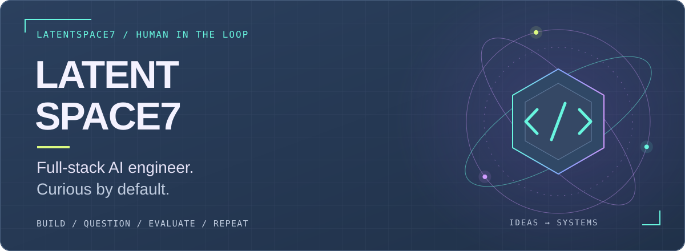
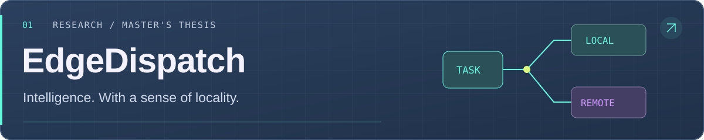
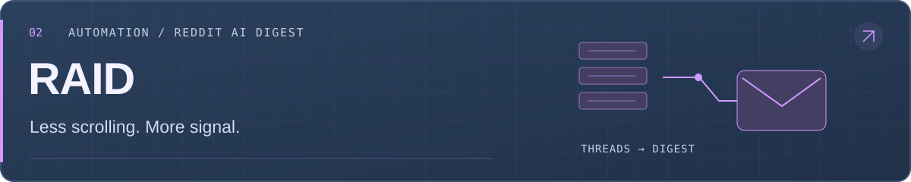
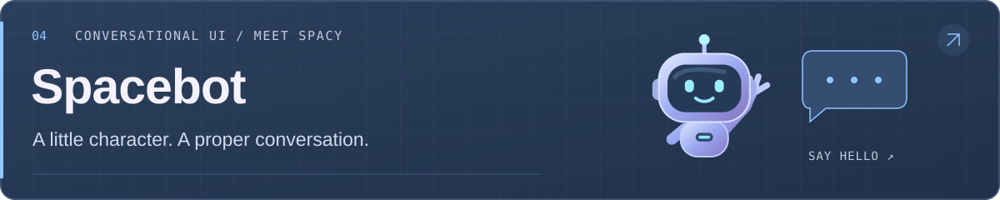

  

  <a href="#projects">Projects</a> &nbsp; / &nbsp;
  <a href="#the-human-behind-the-terminal">The human</a> &nbsp; / &nbsp;
  <a href="https://www.linkedin.com/in/dolwinf/">Let's connect ↗</a>

## The human behind the terminal

Hey, I'm **LatentSpace7** 👋 A full-stack AI engineer with years of experience building **AI applications, RAG pipelines, and agentic systems**, from the interface to the infrastructure.

I'm currently working as an **independent contractor** under my brand [**Vector Space**](https://vectorspace.com.au), migrating a large legacy codebase to a modern stack and building agentic systems around real business workflows.

I've just completed my **Master's in Artificial Intelligence at La Trobe University**. I've embraced **AI-native development** and I'm a big fan: AI as a collaborator throughout the build, with human judgement and evaluation keeping us honest.

[Visit vectorspace.com.au and have a chat with Spacy ↗](https://vectorspace.com.au/#contact)

> Powered by curiosity. Debugged by reality.

## Projects

### [EdgeDispatch](https://github.com/latentspace7/EdgeDispatch) · Master's thesis

**When should a local model handle the task, and when should it ask for backup?**

A local-first agent system that learns execution decisions from reviewed task outcomes. An execution-decision LoRA adapter chooses `LOCAL` or `ESCALATE`; the local base model or a remote model then handles the work. The thesis evaluates decision quality, answer quality, and remote execution API cost.

**Python · React · FastAPI · llama.cpp · LoRA · MCP**

[Explore the code ↗](https://github.com/latentspace7/EdgeDispatch) &nbsp; · &nbsp; [Read the thesis ↗](https://github.com/latentspace7/EdgeDispatch/blob/main/docs/ltu_thesis_b_v1.pdf)

 

### [RAID](https://github.com/latentspace7/raid) · Reddit AI Digest

**Your subreddits, distilled. Your scrolling habit, mildly inconvenienced.**

Collects Reddit threads, summarises them with AI, and delivers a readable email digest with links to the original posts. Built around bounded async processing, with a CLI and an authenticated FastAPI endpoint.

**Python · FastAPI · Async I/O · LLM summarisation · Email**

[Explore the code ↗](https://github.com/latentspace7/raid)

 

### [LiveTranslate](https://github.com/latentspace7/LiveTranslate) · Speech → understanding

**For conversations that shouldn't need a language setting.**

A browser companion that turns nearby speech into live translated captions. Follow the original and translated text together, with optional spoken translations and a layout made for conversations on the go.

**React · TypeScript · FastAPI · WebSockets · Realtime audio**

[Explore the code ↗](https://github.com/latentspace7/LiveTranslate) &nbsp; · &nbsp; [Open the app ↗](https://qwen-live-translate.vercel.app) (sign-in required)

 

### [Spacebot](https://vectorspace.com.au/#contact) · The bot behind Spacy

**A little character. A proper conversation.**

A reusable React chat widget with an animated robot, streaming responses, optional lead capture, and configurable backend integrations. Built to bring personality to the interface while keeping the assistant's services replaceable. **Spacy** is its Vector Space personality.

**React · TypeScript · Motion · Streaming chat · Configurable integrations**

[Visit Vector Space and have a chat with Spacy ↗](https://vectorspace.com.au/#contact)

## Tools I reach for

  

Also in the mix: **RAG, Neo4j, Hugging Face, AWS, GCP, and a lot of evaluation.**

## Good problems welcome

Have an **AI engineering role**, a collaboration, or a problem worth building for? [Let's connect on LinkedIn ↗](https://www.linkedin.com/in/dolwinf/).

  

