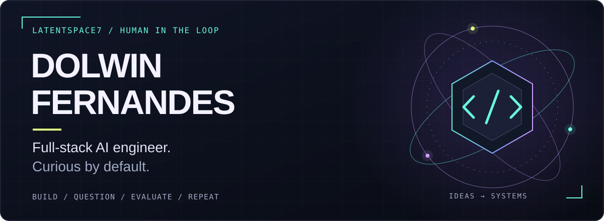
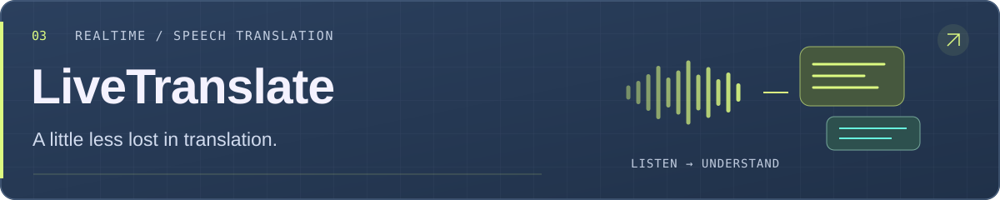

  

  <a href="#selected-projects">Selected projects</a> &nbsp; / &nbsp;
  <a href="#the-human-behind-the-terminal">The human</a> &nbsp; / &nbsp;
  <a href="https://www.linkedin.com/in/dolwinf/">Let's connect ↗</a>

## The human behind the terminal

Hey, I'm **Dolwin** 👋 Full-stack AI engineer, independent consultant, and AI enthusiast with a healthy respect for the evals.

I build across **AI, backend, frontend, and cloud**, working independently under my brand **Vector Space**. I'm pursuing a **Master of Artificial Intelligence at La Trobe University**, exploring how local models and agent systems can do useful work in the real world.

My favourite problems live where **local inference, agentic workflows, and retrieval** meet software people can actually use. This is my corner of the internet for building, experimenting, and asking, “Does it still work outside the demo?”

> Powered by curiosity. Debugged by reality.

## Selected projects

### [EdgeDispatch](https://github.com/latentspace7/EdgeDispatch) · Master's thesis

**When should a local model handle the task, and when should it ask for backup?**

A local-first agent system that learns execution decisions from reviewed task outcomes. An execution-decision LoRA adapter chooses `LOCAL` or `ESCALATE`; the local base model or a remote model then handles the work. The thesis evaluates decision quality, answer quality, and remote execution API cost.

**Python · React · FastAPI · llama.cpp · LoRA · MCP**

[Explore the code ↗](https://github.com/latentspace7/EdgeDispatch) &nbsp; · &nbsp; [Read the thesis ↗](https://github.com/latentspace7/EdgeDispatch/blob/main/docs/ltu_thesis_b_v1.pdf)

 

### [RAID](https://github.com/latentspace7/raid) · Reddit AI Digest

**Your subreddits, distilled. Your scrolling habit, mildly inconvenienced.**

Collects Reddit threads, summarises them with AI, and delivers a readable email digest with links to the original posts. Built around bounded async processing, with a CLI and an authenticated FastAPI endpoint.

**Python · FastAPI · Async I/O · LLM summarisation · Email**

[Explore the code ↗](https://github.com/latentspace7/raid)

 

### [LiveTranslate](https://github.com/latentspace7/LiveTranslate) · Speech → understanding

**For conversations that shouldn't need a language setting.**

A browser companion that turns nearby speech into live translated captions. Follow the original and translated text together, with optional spoken translations and a layout made for conversations on the go.

**React · TypeScript · FastAPI · WebSockets · Realtime audio**

[Explore the code ↗](https://github.com/latentspace7/LiveTranslate) &nbsp; · &nbsp; [Open the app ↗](https://qwen-live-translate.vercel.app) (sign-in required)

## Tools I reach for

  

Also in the mix: **RAG, Neo4j, Hugging Face, AWS, GCP, and a lot of evaluation.**

## Good problems welcome

Have an **AI engineering role**, a collaboration, or a problem worth building for? [Let's connect on LinkedIn ↗](https://www.linkedin.com/in/dolwinf/).

  

